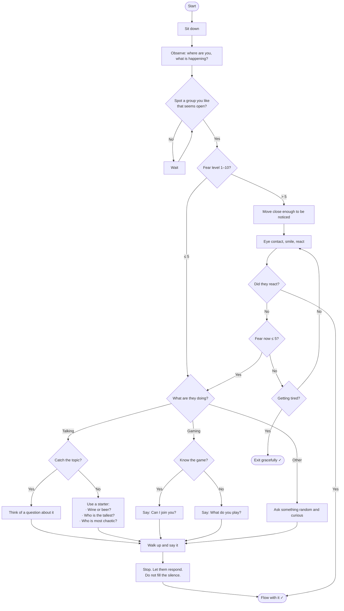

```mermaid
flowchart TD
    A([Start]) --> B[Sit down]
    B --> C[Observe: where are you, what is happening?]
    C --> D{Spot a group you like\nthat seems open?}
    D -- No --> E[Wait] --> D
    D -- Yes --> F{Fear level 1–10?}

    F -- "≤ 5" --> G{What are they doing?}
    F -- "> 5" --> H[Move close enough to be noticed]

    G -- Talking --> I{Catch the topic?}
    I -- Yes --> J[Think of a question about it]
    I -- No --> K["Use a starter:\n· Wine or beer?\n· Who is the tallest?\n· Who is most chaotic?"]
    G -- Gaming --> L{Know the game?}
    L -- Yes --> M["Say: Can I join you?"]
    L -- No --> N["Say: What do you play?"]
    G -- Other --> O[Ask something random and curious]

    J --> P[Walk up and say it]
    K --> P
    M --> P
    N --> P
    O --> P
    P --> Q[Stop. Let them respond.\nDo not fill the silence.]
    Q --> R([Flow with it ✓])

    H --> S[Eye contact, smile, react]
    S --> T{Did they react?}
    T -- Yes --> R
    T -- No --> U{Fear now ≤ 5?}
    U -- Yes --> G
    U -- No --> V{Getting tired?}
    V -- No --> S
    V -- Yes --> W([Exit gracefully ✓])
```
